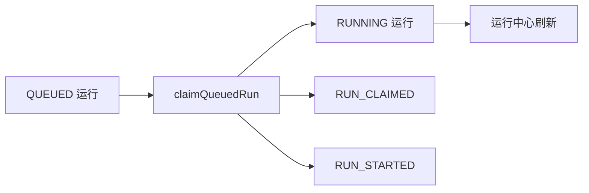

# MatrixCode Agent Runtime 受控队列认领设计

## 背景

第 67 阶段已经支持把可重试失败运行排队为新的 `QUEUED` Agent Run。当前缺口是队列无法被受控推进：运行中心可以看到排队运行，但后端没有统一入口把排队运行认领为 `RUNNING`，后续 Worker 或人工操作者也缺少审计事件表达“谁认领了这次运行”。

第 68 阶段补一个保守的队列认领能力：只把已有 `QUEUED` 运行更新为 `RUNNING` 并追加审计事件，不自动执行模型、命令、文件写入或 Patch。

## 目标

- 后端支持从项目内 `QUEUED` Agent Run 创建受控认领动作。
- 认领成功后保留运行 ID、创建时间、目标、角色、模型、失败摘要和 `retryOfRunId`。
- 认领成功后写入 `RUN_CLAIMED` 和 `RUN_STARTED` 事件，记录认领操作者。
- 非排队、跨项目或不存在运行返回冲突语义，避免 Worker 误消费。
- 桌面端运行中心在排队运行上展示“认领运行”按钮，点击后刷新 Agent Runtime 快照。

## 非目标

- 不实现后台 Worker 自动轮询。
- 不调用模型、不执行本地命令、不写文件、不应用 Patch。
- 不新增数据库表或字段。
- 不改变现有审批策略和本地执行权限。
- 不保存 prompt 正文、模型响应、向量正文、工具输出或密钥。

## 推荐方案

1. 在 `AgentRuntimeService` 增加 `claimQueuedRun(projectId, runId, actorUserId)`。
2. 服务层通过 `findRun(...)` 读取来源运行，校验项目和状态。
3. 认领时构造新的 `AgentRunRecord`，保留来源运行创建时间和恢复字段，只更新状态、开始时间和更新时间。
4. 写入 `RUN_CLAIMED` 和 `RUN_STARTED` 两个事件。
5. Controller 增加 `POST /api/projects/{projectId}/agent-runs/{runId}/claim?actorUserId=...`。
6. 桌面端新增 `claimAgentRun(...)` API 和运行中心按钮，成功后刷新运行列表和事件。

## 数据流

## 错误处理

- 来源运行不存在或不属于项目：返回 `409 CONFLICT`，消息为“运行不存在或不属于当前项目”。
- 来源运行不是 `QUEUED`：返回 `409 CONFLICT`，消息为“只有排队运行可以认领”。
- 角色字符串无法恢复为 `ModelRole`：返回 `409 CONFLICT`，消息保留服务层说明。

## 验证策略

- 服务层 TDD：排队运行认领后进入 `RUNNING`，保留 `retryOfRunId` 和 `createdAt`，追加 `RUN_CLAIMED` / `RUN_STARTED`。
- 服务层 TDD：非排队运行拒绝认领。
- 控制器 TDD：认领接口成功返回 `RUNNING`；非排队返回 409。
- 桌面端 TDD：`claimAgentRun(...)` 请求地址正确；运行中心点击“认领运行”后调用 API 并刷新列表。
- 完成前验证：桌面端目标/全量/构建，服务端目标/全量，真实集成，运行诊断，浏览器抽查，静态检查和敏感信息扫描。

## 回溯对齐

- 与最初需求一致：多人实时协作智能体控制台需要可审计的 Agent 队列推进能力。
- 与第 67 阶段一致：恢复重试只负责排队，第 68 阶段只负责受控认领，不执行工具。
- 与安全边界一致：模型调用、命令执行、文件写入和 Patch 仍走现有审批和业务入口。
- 与上线约束一致：正式运行继续使用 MySQL + MyBatis-Plus，H2 仅用于测试。
