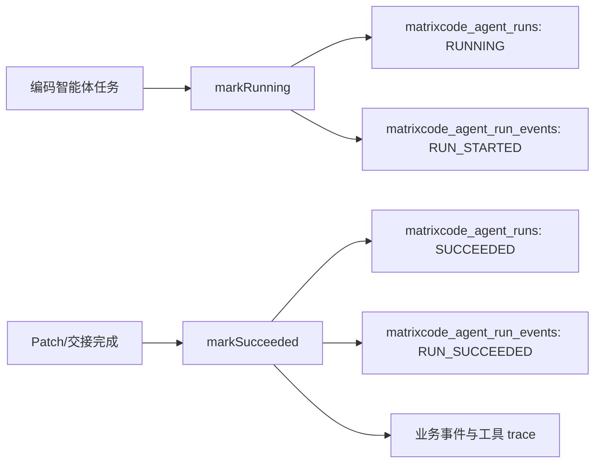

# MatrixCode Agent Runtime 生命周期事件设计

## 背景

MatrixCode 的目标是多人实时协作智能体控制台。每个角色都有自己的智能体工作台，运行过程必须可审计、可回溯、可恢复。当前系统已经有 Agent Run 主记录、运行事件、工具 trace、模型请求 trace、失败恢复事件和运行中心展示能力，但部分成功/运行中链路仍直接调用 `saveRun` 写主记录，缺少统一的 `RUN_STARTED`、`RUN_SUCCEEDED` 生命周期事件。

该缺口会导致运行中心只能看到“准备完成”“Patch 已应用”“交接已记录”等业务事件，无法稳定判断一次 Agent 运行何时真正开始、何时成功结束。后续做自动恢复、运行态告警、审计回放和运行指标聚合时，也缺少统一事件边界。

## 目标

第 66 阶段补齐 Agent Runtime 的运行中与成功生命周期事件，形成统一状态流转入口：

- `markRunning(...)`：保存 `RUNNING` 主记录，并追加 `RUN_STARTED` 事件。
- `markSucceeded(...)`：保存 `SUCCEEDED` 主记录，并追加 `RUN_SUCCEEDED` 事件。
- 编码智能体执行准备、Patch 应用、交接回溯统一使用生命周期入口，而不是散落的 `saveRun`。
- 前端运行中心可以自然展示生命周期事件，不引入新的复杂 UI。

## 非目标

- 本阶段不新增数据库表；允许通过 Flyway 扩展既有 Agent Runtime 时间字段精度，用于修复真实 MySQL 同一秒事件排序不稳定。
- 本阶段不实现异步 Worker 自动重试调度，只为后续自动恢复提供可靠事件边界。
- 本阶段不把完整 Prompt、模型响应、命令输出或密钥写入事件。
- 本阶段不改变现有运行状态枚举语义。

## 推荐方案

采用“应用服务统一生命周期方法”的方案：

1. 在 `AgentRuntimeService` 增加 `markRunning(...)` 和 `markSucceeded(...)`。
2. 两个方法内部调用现有 `saveRun(...)`，复用时间归一、仓储写入、无仓储降级逻辑。
3. 两个方法追加低敏事件：
   - `RUN_STARTED` / `运行开始`
   - `RUN_SUCCEEDED` / `运行成功`
4. 事件 payload 只包含短摘要、供应商、模型、角色和 Agent 类型，不包含 Prompt、文件内容、命令输出、API Key、数据库密码。
5. 编码智能体的执行准备、Patch 应用、交接回溯改为调用生命周期方法。
6. `matrixcode_agent_runs` 和 `matrixcode_agent_run_events` 的时间字段扩展为 `timestamp(6)`，保证同一秒内写入的生命周期事件、业务事件和工具 trace 能按微秒精度稳定排序。

## 数据流



## 事件契约

`RUN_STARTED` payload：

```json
{
  "summary": "执行准备已生成",
  "providerId": "deepseek",
  "modelName": "deepseek-chat",
  "role": "DEVELOPER",
  "agentKind": "coding"
}
```

`RUN_SUCCEEDED` payload：

```json
{
  "summary": "补充入口",
  "providerId": "deepseek",
  "modelName": "deepseek-chat",
  "role": "DEVELOPER",
  "agentKind": "coding"
}
```

## 测试策略

- 服务层 TDD：
  - `markRunning(...)` 保存 `RUNNING` 主记录并追加 `RUN_STARTED`。
  - `markSucceeded(...)` 保存 `SUCCEEDED` 主记录并追加 `RUN_SUCCEEDED`。
- 编码智能体集成单测：
  - 执行准备事件顺序变为 `TASK_PLANNED -> RUN_STARTED -> EXECUTION_PREPARED -> TOOL_TRACE -> TOOL_TRACE`。
  - Patch 成功事件顺序变为 `RUN_SUCCEEDED -> PATCH_APPLIED -> TOOL_TRACE`。
  - 交接回溯事件顺序变为 `RUN_SUCCEEDED -> HANDOFF_RECORDED -> TOOL_TRACE`。
- 前端单测：
  - mock 运行事件包含 `RUN_STARTED` 和 `RUN_SUCCEEDED`。
  - 运行中心时间线能显示生命周期标题。
- 完成前验证：
  - 后端目标测试。
  - 前端目标测试。
  - 全量前端测试和构建。
  - 后端 server 模块全量测试。
  - 真实运行集成测试。
  - 浏览器运行中心抽查。
  - 敏感信息扫描。

## 回溯对齐

该阶段与最初需求保持一致：

- 多角色智能体控制台需要清晰的运行中心，本阶段补齐统一生命周期。
- 每个角色独立智能体配置不受影响，生命周期事件复用角色配置中的供应商和模型。
- 真实数据库能力不新增表，只扩展既有时间字段精度，继续复用 MySQL + MyBatis-Plus 仓储。
- DeepSeek-Reasonix 风格的缓存治理不被破坏，模型请求 trace 继续独立保留缓存分区数据。
- 真实密钥继续只留在本地环境文件，不写入仓库和 Obsidian。
