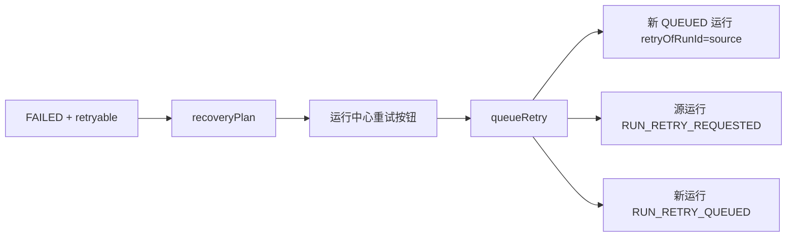

# MatrixCode Agent Runtime 恢复重试队列设计

## 背景

MatrixCode 已经具备 Agent 运行主记录、事件时间线、失败摘要、可重试标记、重试来源字段、生命周期事件和运行中心展示能力。当前缺口是：失败运行虽然能显示“可重试”，但没有统一的恢复入口，用户或后续调度器无法把一次失败运行安全地转成新的排队运行。

第 67 阶段补一个低风险恢复队列能力：只创建新的 `QUEUED` Agent Run 和审计事件，不自动执行代码、不自动执行命令、不绕过审批。

## 目标

- 后端支持查询单次运行的恢复计划，明确是否可重试、阻塞原因和推荐动作。
- 后端支持从可重试失败运行创建新的排队运行，保留 `retryOfRunId` 指向失败来源。
- 原始失败运行写入“已创建恢复重试”事件，新运行写入“恢复重试已排队”事件。
- 桌面端运行中心在失败且可重试的运行上展示“重试运行”按钮。
- 点击按钮后调用后端恢复接口，并刷新 Agent 运行列表和事件。

## 非目标

- 不实现后台 Worker 自动消费 `QUEUED` 运行。
- 不自动执行命令、写文件、调用模型或应用 Patch。
- 不新增数据库表或字段。
- 不保存 prompt 正文、模型响应、向量正文、工具输出或密钥。

## 推荐方案

1. 在 `AgentRuntimeRepository` 增加 `findRun(String runId)`，MyBatis-Plus 仓储按主键查询。
2. 新增领域记录 `AgentRunRecoveryPlan`，表达 sourceRunId、canRetry、blockedReason、recommendedAction 和 sourceRun。
3. 在 `AgentRuntimeService` 增加：
   - `recoveryPlan(projectId, runId)`：只读判断恢复状态。
   - `queueRetry(projectId, runId, actorUserId)`：创建新的 `QUEUED` 运行和恢复事件。
4. 在 `AgentRuntimeController` 增加：
   - `GET /api/projects/{projectId}/agent-runs/{runId}/recovery-plan`
   - `POST /api/projects/{projectId}/agent-runs/{runId}/retry?actorUserId=...`
5. 桌面端新增 `retryAgentRun(...)` API client 和运行中心按钮，成功后刷新工作台 Agent Runtime 快照。

## 数据流

## 验证策略

- 服务层 TDD：可重试失败运行能生成计划和新排队运行；非失败、不可重试、跨项目运行会拒绝重试。
- 控制器 TDD：恢复计划和重试接口可用。
- MyBatis-Plus TDD：`findRun(...)` 可从正式表读回运行。
- 桌面端 TDD：可重试失败运行展示按钮，点击调用 `retryAgentRun(...)` 并刷新。
- 完成前验证：桌面端目标/全量/构建、服务端目标/全量、真实集成、运行诊断、浏览器抽查、静态检查和敏感信息扫描。

## 回溯对齐

- 与最初需求一致：多人实时协作智能体控制台需要失败恢复和审计闭环。
- 与安全边界一致：本阶段只排队，不执行工具，不绕过本地执行审批。
- 与第 53、54、66 阶段一致：失败恢复、工具 trace 和生命周期事件继续走 Agent Runtime 时间线。
- 与上线约束一致：正式运行仍使用 MySQL + MyBatis-Plus，H2 仅用于测试。
