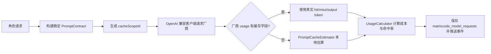

# MatrixCode 模型缓存用量增强设计

## 背景

用户要求 MatrixCode 的智能体控制台参考 `esengine/DeepSeek-Reasonix`，围绕大模型厂商的前缀缓存机制降低 token 成本。当前模型网关已经有稳定系统前缀、稳定前缀哈希和本地缓存命中估算，但 OpenAI 兼容客户端只返回回答文本，服务层无法读取 DeepSeek 等供应商响应中的真实缓存用量。

本阶段将模型调用结果从纯文本提升为结构化结果，使网关可以优先采用厂商返回的缓存命中/未命中 token；当厂商未返回相关字段时，继续使用现有稳定前缀估算兜底。

## 参考来源

- DeepSeek 官方 Context Caching 文档：相同请求前缀可以触发缓存命中，响应 `usage` 中提供 `prompt_cache_hit_tokens` 与 `prompt_cache_miss_tokens`。
- DeepSeek-Reasonix `main-v2` README：项目围绕 DeepSeek prefix cache 稳定性设计，模型供应商通过配置声明。
- DeepSeek-Reasonix `internal/agent/cache_shape.go`：通过系统提示词、工具 schema 和 prefix hash 诊断缓存形状变化。
- DeepSeek-Reasonix `internal/provider/openai/realcache_test.go`：以真实 DeepSeek API 探测 cache hit、cache miss 和 reasoning 回传对缓存的影响。

## 目标

1. OpenAI 兼容模型客户端返回结构化 `ModelCompletionResult`，包含回答文本和可选供应商 token 用量。
2. DeepSeek 等返回 `prompt_cache_hit_tokens` / `prompt_cache_miss_tokens` 的供应商，网关优先使用真实字段计算成本和指标。
3. 对所有 OpenAI 兼容请求生成稳定缓存作用域 `matrixcode_<project>_<role>_<provider>_<model>`，用于厂商侧缓存隔离参数和本地估算 key。
4. 厂商未返回缓存字段时，保持当前本地稳定前缀估算逻辑，不降低已有功能。
5. 保持前端与历史数据兼容：`UsageRecord.roleSessionId` 仍是 `项目:角色`，现有 API 结构不破坏。

## 非目标

- 本阶段不改数据库表结构；现有 `matrixcode_model_requests` 已能保存命中、未命中、输出 token 和成本。
- 本阶段不引入新 Agent 框架；下一阶段继续处理角色智能体执行质量和工作台体验。
- 本阶段不把任何 API Key、数据库密码、Redis/RocketMQ 地址写入规格以外的安全位置；密钥仍由环境变量承载。

## 方案

推荐方案是“真实用量优先，估算兜底”。具体做法：

1. 新增 `ModelCompletionResult`，字段为 `answer` 和 `usage`。
2. 新增 `ProviderTokenUsage`，字段为 `cacheHitTokens`、`cacheMissInputTokens`、`outputTokens`，并提供 `hasPromptCacheTokens()` 判断。
3. 将 `ModelCompletionClient.complete(...)` 改为返回 `ModelCompletionResult`，并传入 `cacheScopeId`。
4. `OpenAiCompatibleModelClient` 解析响应：
   - `choices[0].message.content` 作为回答。
   - `usage.prompt_cache_hit_tokens` 和 `usage.prompt_cache_miss_tokens` 作为缓存用量。
   - `usage.completion_tokens` 作为输出 token。
   - 如果供应商是 DeepSeek，在请求体中写入 `user_id=cacheScopeId`，让厂商侧缓存作用域和 MatrixCode 角色会话一致。
   - `cacheScopeId` 只保留 DeepSeek `user_id` 允许的字母、数字、下划线和短横线；点号、冒号等字符统一转为下划线。
5. `ModelGatewayService` 调用模型后：
   - 如果结构化结果包含缓存字段，直接用这些 token 计算 `UsageRecord`。
   - 否则调用 `PromptCacheEstimator` 估算。
   - `PromptCacheEstimator` 使用 `cacheScopeId + stablePrefixHash` 跟踪本地命中，避免不同供应商、模型之间错误共享。

## 数据流

## 验证标准

- `OpenAiCompatibleModelClientTest` 验证：
  - DeepSeek 请求体包含 `user_id`，普通兼容供应商不额外写该字段。
  - 客户端解析 `prompt_cache_hit_tokens`、`prompt_cache_miss_tokens`、`completion_tokens`。
- `ModelGatewayServiceTest` 验证：
  - 供应商返回真实缓存用量时，服务层指标使用真实字段。
  - 未返回真实用量时，第二次同缓存作用域请求仍走本地估算命中。
  - 不同供应商或模型不会共享本地缓存作用域。
- `RealRuntimeIntegrationTest` 验证：
  - 真实 DeepSeek Chat 能接受合法 `user_id`，并返回缓存命中/未命中 token 字段。
- 完成后运行模型网关相关测试、服务端全量测试、真实本地集成检查，并执行密钥扫描。

## 回溯结论

该设计对齐最初诉求：多人实时协作智能体控制台、每个角色独立模型配置、真实大模型可用、成本可观测、逐阶段上线化。它没有偏离 MySQL/Milvus/Redis/RocketMQ 的整体基础设施约定，也不引入 H2 到正式运行路径。
