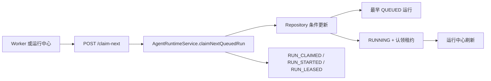

# MatrixCode Agent Runtime 受控 Worker 认领设计

## 背景

第 67 阶段已经支持把可重试失败运行排队为新的 `QUEUED` Agent Run。第 68 阶段已经支持按运行 ID 把单条 `QUEUED` 运行受控认领为 `RUNNING`。当前缺口是：后续 Worker 不能安全地从项目队列中自动拿下一条任务，也没有结构化字段记录认领人、认领时间和租约到期时间。

如果只在服务层先查第一条 `QUEUED` 再保存状态，两个 Worker 可能同时选中同一条运行。第 69 阶段需要把队列消费推进到可上线的前置形态：数据库层使用条件更新保证同一条运行只能被一个 Worker 成功认领，同时保留租约元数据，便于后续恢复卡住的 `RUNNING` 运行。

## 目标

- 后端支持 `claimNextQueuedRun(projectId, actorUserId)`，从项目内最早的 `QUEUED` 运行中受控认领一条。
- MyBatis-Plus 仓储使用条件更新实现并发锁：只有 `status=QUEUED` 的记录能被更新为 `RUNNING`。
- `matrixcode_agent_runs` 增加 `claimed_by_user_id`、`claimed_at`、`claim_expires_at`，所有字段带详细注释。
- 认领成功后写入 `RUN_CLAIMED`、`RUN_STARTED` 和 `RUN_LEASED` 事件。
- HTTP 新增 `POST /api/projects/{projectId}/agent-runs/claim-next`，队列为空时返回 `204 No Content`。
- 桌面端运行中心增加“认领下一条”入口，成功后刷新 Agent Runtime 快照。

## 非目标

- 不实现模型调用、命令执行、文件写入或 Patch 应用。
- 不实现后台无限轮询线程；本阶段只提供可被 Worker 调用的受控认领入口。
- 不恢复已过期租约；本阶段只写入租约元数据，后续阶段再实现超时恢复策略。
- 不把 Redis 或 RocketMQ 变成业务强依赖；后续跨节点事件流再接入。
- 不保存 prompt 正文、模型响应、向量正文、工具输出、API Key 或数据库密码。

## 推荐方案

1. 扩展 `AgentRunRecord`，新增 `claimedByUserId`、`claimedAt`、`claimExpiresAt`，保留旧构造器兼容现有测试。
2. 新增 Flyway 迁移 `V69_1__extend_agent_run_claim_lease.sql`，为 `matrixcode_agent_runs` 补认领与租约字段和队列查询索引。
3. 在 `AgentRuntimeRepository` 增加 `claimNextQueuedRun(projectId, claimedByUserId, claimedAt, claimExpiresAt)`。
4. `MybatisPlusAgentRuntimeRepository` 先按项目、状态和创建时间读取候选，再用 `WHERE id=? AND project_id=? AND status='QUEUED'` 条件更新；更新成功才返回最新主记录。
5. `AgentRuntimeService.claimNextQueuedRun(...)` 计算租约时间，调用仓储原子认领，并追加低敏审计事件。
6. Controller 暴露 `POST /claim-next`，队列为空返回 `204`，状态冲突由仓储返回空而不是抛异常。
7. 桌面端新增 API 和运行中心按钮，按钮只触发认领，不执行后续模型或工具。

## 数据流

## 错误处理

- 项目 ID 为空：返回参数校验异常。
- 队列为空或并发竞争失败：返回空结果，HTTP 表达为 `204 No Content`。
- 数据库更新失败：按持久化异常向上抛出，避免生产环境静默丢失队列状态。
- 认领人为空：归一为 `system`，并确保正式用户外键可写。

## 验证策略

- 服务层 TDD：项目内有多个 `QUEUED` 运行时，只认领最早的一条，并写入租约事件。
- 服务层 TDD：项目内没有 `QUEUED` 运行时返回空。
- 仓储 TDD：MyBatis-Plus 认领后只更新一条，第二次认领拿到下一条或空，已 `RUNNING` 的记录不会被重复认领。
- 迁移 TDD：新增字段和索引可在 H2 MySQL 模式执行，字段注释门禁通过。
- 控制器 TDD：`POST /claim-next` 成功返回 `RUNNING`；队列为空返回 `204`。
- 桌面端 TDD：`claimNextAgentRun(...)` 请求地址正确；运行中心点击“认领下一条”后刷新快照。
- 完成前验证：桌面端全量、桌面构建、服务端全量、真实运行检查、真实 `RealRuntimeIntegrationTest`、静态检查、旧地址/旧 collection 残留扫描和敏感信息扫描。

## 回溯对齐

- 与最初需求一致：多人实时协作智能体控制台需要多个 Worker 或操作者安全推进队列，不能靠手工按 ID 点选。
- 与第 67、68 阶段一致：第 67 阶段排队，第 68 阶段按 ID 认领，第 69 阶段补项目级下一条认领和租约元数据。
- 与安全边界一致：本阶段只认领运行，不调用模型、不执行命令、不写文件、不应用 Patch。
- 与上线约束一致：正式运行使用 MySQL + MyBatis-Plus；H2 只用于测试；新增 DDL 必须写表和字段注释。
