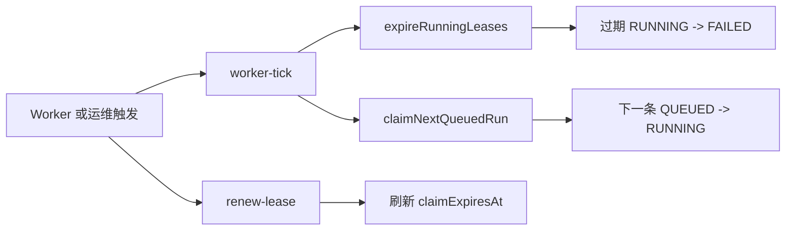

# MatrixCode Agent Runtime Worker 租约治理设计

## 背景

第 69 阶段已经支持项目级认领下一条 `QUEUED` 运行，并在主记录上保存 `claimedByUserId`、`claimedAt` 和 `claimExpiresAt`。当前缺口是：被认领为 `RUNNING` 的运行还不能续租，也不能在租约过期后被系统性回收。这样一旦 Worker 崩溃或网络中断，运行中心会长期保留卡住的 `RUNNING` 记录。

本阶段不直接启用后台自动线程，也不执行模型调用、命令执行、文件写入或 Patch 应用。原因是当前还没有真实 Agent 执行 handler；如果自动 claim 后没有真实执行闭环，会把排队任务推进到长期 `RUNNING`，反而降低可用性。

## 目标

- 服务层提供 `renewClaimLease(projectId, runId, actorUserId)`，只有当前认领人能续租 `RUNNING` 运行。
- 服务层提供 `expireRunningLeases(projectId, limit)`，把租约过期的 `RUNNING` 运行受控标记为 `FAILED`，并保留可重试恢复入口。
- 仓储层使用 MyBatis-Plus 条件更新，避免续租和过期回收互相覆盖。
- 新增 `AgentRuntimeWorkerService.tick(projectId, workerId)`，单次 tick 先回收过期租约，再尝试认领下一条排队运行。
- HTTP 暴露受控 Worker tick 和续租入口，方便真实 Worker、运维脚本或运行中心后续接入。
- 所有事件只写低敏摘要：`RUN_LEASE_RENEWED`、`RUN_LEASE_EXPIRED` 和既有 `RUN_FAILED`。

## 非目标

- 不启用 `@Scheduled` 后台轮询。
- 不调用大模型、不执行本地命令、不写入文件、不应用 Patch。
- 不引入 Redis 或 RocketMQ 强依赖。
- 不新增数据库字段；继续复用第 69 阶段租约字段。
- 不保存完整 prompt、模型响应、工具输出、API Key 或数据库密码。

## 推荐方案

1. 在 `AgentRuntimeRepository` 增加 `renewClaimLease(...)` 和 `expireRunningLeases(...)` 默认方法。
2. 在 `MybatisPlusAgentRuntimeRepository` 使用条件更新：
   - 续租条件：`id`、`project_id`、`status=RUNNING`、`claimed_by_user_id` 匹配。
   - 过期条件：`status=RUNNING`、`claim_expires_at <= now`。
3. `AgentRuntimeService` 负责计算新租约、追加续租/过期/失败事件，并把过期运行标记为可重试失败。
4. 新建 `AgentRuntimeWorkerService` 和 `AgentRuntimeWorkerTickResult`，以单次可控 tick 表达 Worker 行为。
5. Controller 新增：
   - `POST /api/projects/{projectId}/agent-runs/{runId}/renew-lease`
   - `POST /api/projects/{projectId}/agent-runs/worker-tick`

## 数据流

## 错误处理

- 项目 ID、运行 ID 为空：参数异常。
- 续租目标不存在、不是 `RUNNING` 或认领人不匹配：返回空，HTTP 表达为 `204 No Content`。
- 过期回收时并发续租成功：条件更新失败，该运行不进入回收结果。
- 数据库异常：向上抛出，避免生产环境静默丢失运行状态。

## 验证策略

- 服务层 TDD：同一认领人续租成功，并写入 `RUN_LEASE_RENEWED`。
- 服务层 TDD：非认领人续租返回空。
- 服务层 TDD：过期 `RUNNING` 被标记为 `FAILED`、`retryable=true`，并写入 `RUN_LEASE_EXPIRED` 与 `RUN_FAILED`。
- 仓储 TDD：MyBatis-Plus 条件更新保证非认领人不能续租；过期回收只更新到期运行。
- Controller TDD：续租成功返回记录，失败返回 `204`；Worker tick 返回过期数量和认领结果。
- 真实集成：真实 MySQL `matrix_code` 上执行续租、过期回收和 worker tick。
- 完成前验证：服务端目标测试、服务端全量、桌面端全量、桌面构建、真实运行检查、真实集成、`git diff --check`、旧地址扫描和敏感信息扫描。

## 回溯对齐

- 与最初多人实时协作智能体控制台需求一致：租约治理让多个 Worker 或角色工作台不会长期占用同一运行。
- 与第 67 到 69 阶段一致：先排队，再认领，再补租约续期和过期恢复，不跳到不受控自动执行。
- 与上线约束一致：正式链路继续使用 MySQL + MyBatis-Plus；H2 只用于测试；不新增正式 H2 依赖。
- 与安全边界一致：本阶段仍不执行高风险工具动作，所有运行事件都保持低敏摘要。
